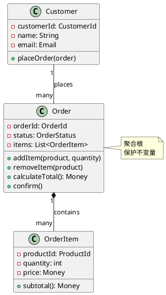
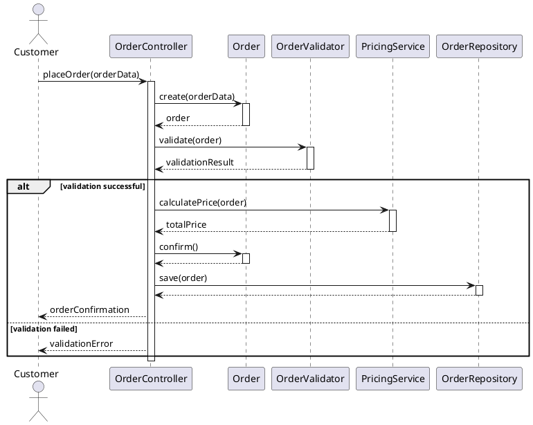
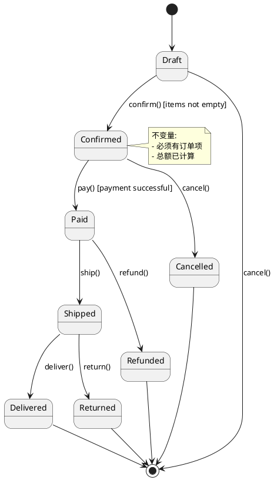
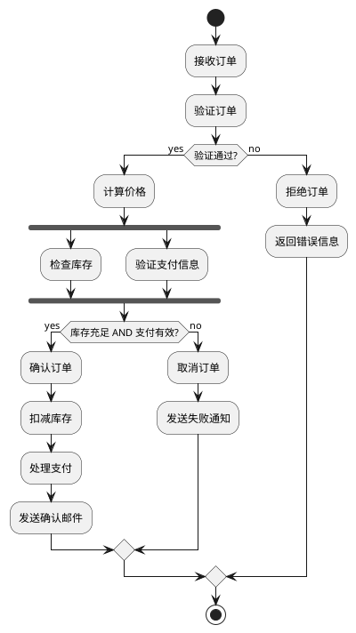
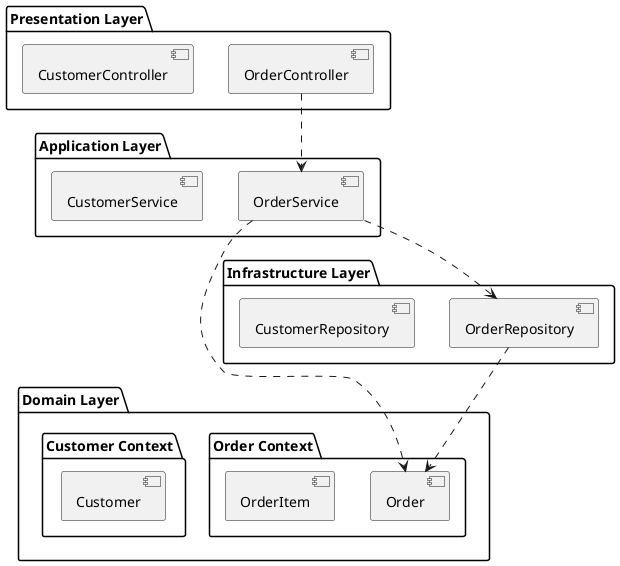

# 面向对象建模专家 Agent 理论基础文档

## 概述

本文档详细说明了 oo-modeler agent 的认知内核设计,基于面向对象建模领域四本经典著作的理论整合。这四本书构成了从职责驱动设计到形式化建模的完整方法论体系。

## 一、认知内核的四层架构

### 1. 责任驱动核心 (Responsibility-Driven Core)

**理论来源**: *Object Design: Roles, Responsibilities, and Collaborations* by Rebecca Wirfs-Brock, Alan McKean (2003, 第2版)

#### 为什么是经典

这本书是面向对象设计领域的里程碑著作,原因如下:

1. **范式转变**: 从"数据驱动"转向"职责驱动"
   - 传统方法: 先定义数据结构,再添加行为
   - RDD 方法: 先定义职责,再确定数据需求
   - 这个转变彻底改变了 OO 设计的思维方式

2. **CRC 卡片方法**: 简单而强大的设计工具
   - Class-Responsibility-Collaborator 三元组
   - 促进团队协作设计
   - 快速探索设计方案

3. **角色构造型**: 系统化的对象分类
   - Information Holder, Service Provider, Controller 等
   - 提供了对象识别的模式语言
   - 帮助设计者快速定位对象职责

4. **契约式设计**: 明确协作关系
   - 前置条件和后置条件
   - 客户-供应商关系
   - 为后来的契约式编程奠定基础

#### 核心理论

##### 1.1 职责的本质

**定义**: 职责是对象应该承担的义务,分为两类:
- **Doing 职责**: 对象自己做的事情
  - 执行计算
  - 创建其他对象
  - 协调其他对象的活动
  - 控制和协调活动
  
- **Knowing 职责**: 对象知道的信息
  - 私有封装的数据
  - 相关对象的引用
  - 可以计算或派生的信息

**关键洞察**: 
- 职责不是方法,而是更高层次的抽象
- 一个职责可能对应多个方法
- 职责定义了"做什么",而非"怎么做"

##### 1.2 角色构造型 (Role Stereotypes)

Wirfs-Brock 识别了六种基本角色:

1. **Information Holder (信息持有者)**
   - 知道并提供信息
   - 例如: Customer, Product, Order
   - 通常对应领域实体

2. **Structurer (结构器)**
   - 维护对象之间的关系
   - 例如: OrderCollection, ProductCatalog
   - 管理对象的组织和查找

3. **Service Provider (服务提供者)**
   - 执行工作并提供服务
   - 例如: PricingService, ValidationService
   - 通常是无状态的

4. **Coordinator (协调器)**
   - 协调其他对象的活动
   - 例如: OrderProcessor, WorkflowEngine
   - 实现复杂的业务流程

5. **Controller (控制器)**
   - 处理外部事件
   - 例如: OrderController, PaymentController
   - 系统与外部的接口

6. **Interfacer (接口器)**
   - 转换信息或请求
   - 例如: DataMapper, ProtocolAdapter
   - 适配不同的接口或协议

##### 1.3 协作契约

**契约的组成**:
- **前置条件**: 客户必须确保的条件
- **后置条件**: 供应商必须确保的结果
- **不变量**: 始终保持的约束

**协作模式**:
- **请求-响应**: 同步调用
- **通知**: 异步通知
- **委托**: 转发职责

##### 1.4 设计启发式

Wirfs-Brock 提出的关键设计原则:

1. **分配职责给信息专家**
   - 将职责分配给拥有完成该职责所需信息的对象
   - 这是 GRASP 模式的起源

2. **保持协作简单**
   - 减少协作者数量
   - 避免长的消息链
   - 使用中介者降低耦合

3. **隐藏设计决策**
   - 封装变化点
   - 使用接口而非实现
   - 保护客户免受变化影响

4. **分离接口和实现**
   - 定义清晰的公共接口
   - 隐藏实现细节
   - 支持多种实现

#### 在认知内核中的应用

责任驱动设计是整个认知内核的基础:
- 提供了对象设计的基本思维模式
- CRC 卡片作为初始设计工具
- 角色构造型指导对象识别
- 协作契约确保设计质量

---

### 2. 交互与场景建模 (Interaction & Scenario Modeling)

**理论来源**: *Writing Effective Use Cases* by Alistair Cockburn (2000)

#### 为什么是经典

虽然这本书主要讲用例,但它对 OO 建模有深远影响:

1. **场景驱动设计**: 通过具体场景发现对象和职责
2. **目标层次**: 提供了不同抽象层次的视角
3. **扩展场景**: 系统化处理变化和异常
4. **参与者映射**: 从用例参与者到对象的自然过渡

#### 核心理论

##### 2.1 用例与对象的关系

**用例是对象交互的场景描述**:
- 用例的每个步骤对应一个或多个对象交互
- 用例的参与者通常映射为边界对象或控制器
- 用例的主成功场景揭示核心对象协作
- 用例的扩展场景揭示异常处理职责

**从用例到对象的映射**:

| 用例元素 | 对象模型元素 |
|---------|-------------|
| 参与者 | 边界对象、控制器 |
| 主成功场景 | 对象交互序列 |
| 步骤 | 消息传递 |
| 扩展场景 | 异常处理职责 |
| 前置条件 | 对象状态约束 |
| 后置条件 | 对象状态变化 |

##### 2.2 场景走查技术

**目的**: 通过走查场景来发现和验证对象设计

**步骤**:
1. 选择一个用例场景
2. 识别参与的对象
3. 逐步走查每个步骤
4. 为每个步骤分配职责
5. 识别需要的协作
6. 验证职责分配的合理性

**示例**: 下单场景

```
用例步骤: 1. 客户提交订单
对象交互:
  Customer -> OrderController: submitOrder(orderData)
  OrderController -> Order: create(orderData)
  OrderController -> OrderValidator: validate(order)
  OrderController -> OrderRepository: save(order)
  
职责识别:
  - OrderController: 协调订单创建流程 (Coordinator)
  - Order: 持有订单信息 (Information Holder)
  - OrderValidator: 验证订单 (Service Provider)
  - OrderRepository: 持久化订单 (Structurer)
```

##### 2.3 目标层次与对象粒度

Cockburn 的目标层次对应不同粒度的对象:

- **Summary Level (云层)**: 系统级对象、子系统
- **User Goal Level (海平面)**: 业务对象、聚合
- **Subfunction Level (鱼层)**: 细粒度对象、值对象

这个层次结构帮助我们:
- 在正确的抽象层次设计对象
- 避免过度细化或过度粗化
- 保持对象粒度的一致性

##### 2.4 扩展场景与异常处理

**扩展场景揭示的职责**:
- 验证职责: 检查前置条件
- 错误处理职责: 处理异常情况
- 补偿职责: 回滚或恢复
- 通知职责: 报告错误

**设计模式**:
- **Guard 模式**: 在操作前检查条件
- **Exception Handler 模式**: 专门的异常处理对象
- **Compensator 模式**: 执行补偿操作的对象

#### 在认知内核中的应用

- 使用用例场景作为对象设计的输入
- 通过场景走查发现对象和职责
- 用例的目标层次指导对象粒度
- 扩展场景确保异常处理的完整性

---

### 3. 语义桥梁 (Semantic Bridge)

**理论来源**: *Domain-Driven Design* by Eric Evans (2003)

#### 为什么是经典

DDD 在 OO 建模中的地位无可替代:

1. **统一语言**: 解决了业务与技术的鸿沟
2. **战术模式**: 提供了具体的对象设计模式
3. **战略模式**: 指导大型系统的架构划分
4. **模型驱动**: 强调模型与代码的一致性

#### 核心理论

##### 3.1 统一语言 (Ubiquitous Language)

**定义**: 团队在所有交流中使用的共同语言,包括:
- 代码中的类名、方法名
- 文档中的术语
- 会议中的讨论
- 用户界面的标签

**为什么重要**:
- 消除翻译成本和误解
- 模型即语言,语言即模型
- 促进深层次的领域理解
- 使代码成为设计文档

**实践方法**:
- 维护词汇表
- 在代码中使用领域术语
- 拒绝技术术语污染领域模型
- 通过对话精化语言

##### 3.2 战术模式 (Tactical Patterns)

DDD 提供了六个核心战术模式,直接指导对象设计:

#### 3.2.1 Entity (实体)

**定义**: 有唯一标识和生命周期的对象

**特征**:
- 有唯一标识 (ID)
- 可变的 (状态会改变)
- 标识的连续性 (即使属性变化,仍是同一对象)
- 有生命周期 (创建、修改、删除)

**设计要点**:
- 标识是本质,属性是偶然
- 重写 equals() 基于标识
- 关注生命周期管理
- 状态转换要保护不变量

**示例**:
```java
public class Order {
    private final OrderId id;  // 唯一标识
    private OrderStatus status;
    private List<OrderItem> items;
    
    // 标识相等
    public boolean equals(Object obj) {
        if (!(obj instanceof Order)) return false;
        Order other = (Order) obj;
        return this.id.equals(other.id);
    }
    
    // 状态转换保护不变量
    public void confirm() {
        if (status != OrderStatus.DRAFT) {
            throw new IllegalStateException("Only draft orders can be confirmed");
        }
        if (items.isEmpty()) {
            throw new IllegalStateException("Cannot confirm empty order");
        }
        this.status = OrderStatus.CONFIRMED;
    }
}
```

#### 3.2.2 Value Object (值对象)

**定义**: 由属性定义的不可变对象

**特征**:
- 无标识 (由属性值定义)
- 不可变 (创建后不能修改)
- 可替换 (相同属性值的对象可互换)
- 描述性的 (描述事物的特征)

**设计要点**:
- 重写 equals() 基于属性值
- 所有字段 final
- 没有 setter 方法
- 修改返回新对象

**示例**:
```java
public final class Money {
    private final BigDecimal amount;
    private final Currency currency;
    
    public Money(BigDecimal amount, Currency currency) {
        this.amount = amount;
        this.currency = currency;
    }
    
    // 值相等
    public boolean equals(Object obj) {
        if (!(obj instanceof Money)) return false;
        Money other = (Money) obj;
        return this.amount.equals(other.amount) 
            && this.currency.equals(other.currency);
    }
    
    // 修改返回新对象
    public Money add(Money other) {
        if (!this.currency.equals(other.currency)) {
            throw new IllegalArgumentException("Currency mismatch");
        }
        return new Money(this.amount.add(other.amount), this.currency);
    }
}
```

**何时使用值对象**:
- 度量、数量、金额
- 日期、时间范围
- 地址、电话号码
- 颜色、坐标
- 任何"描述性"的概念

#### 3.2.3 Aggregate (聚合)

**定义**: 一组相关对象的集合,作为数据修改的单元

**核心概念**:
- **聚合根 (Aggregate Root)**: 聚合的入口,唯一可以被外部引用的对象
- **一致性边界**: 聚合内的不变量必须在事务结束时得到满足
- **事务边界**: 一个事务只修改一个聚合

**设计规则**:
1. 外部只能引用聚合根
2. 聚合根负责保护不变量
3. 内部对象通过根访问
4. 聚合之间通过 ID 引用,而非对象引用

**示例**:
```java
// 聚合根
public class Order {
    private final OrderId id;
    private List<OrderItem> items;  // 内部实体
    
    // 外部不能直接访问 items
    // 只能通过聚合根的方法
    public void addItem(Product product, int quantity) {
        // 保护不变量: 同一产品不能重复添加
        if (hasProduct(product.getId())) {
            throw new IllegalArgumentException("Product already in order");
        }
        items.add(new OrderItem(product.getId(), quantity));
    }
    
    // 计算总额 - 确保一致性
    public Money calculateTotal() {
        return items.stream()
            .map(OrderItem::subtotal)
            .reduce(Money.ZERO, Money::add);
    }
}

// 内部实体 - 不能被外部直接访问
class OrderItem {
    private final ProductId productId;  // 通过 ID 引用,而非对象引用
    private int quantity;
    
    Money subtotal() {
        // 计算小计
    }
}
```

**聚合设计原则**:
- **小聚合**: 尽可能小,只包含必须保持一致性的对象
- **通过 ID 引用**: 聚合之间不直接引用对象
- **最终一致性**: 聚合之间的一致性可以是最终一致的
- **事务边界**: 一个事务只修改一个聚合

#### 3.2.4 Domain Service (领域服务)

**定义**: 表达领域操作但不自然属于任何实体或值对象的无状态对象

**何时使用**:
- 操作涉及多个聚合
- 操作不自然属于任何单一对象
- 操作是领域概念,但不是"事物"

**设计要点**:
- 无状态 (不保存数据)
- 接口用领域语言定义
- 协调多个领域对象
- 不要滥用 (能放在实体中的不要放在服务中)

**示例**:
```java
// 转账服务 - 涉及两个账户聚合
public class TransferService {
    public void transfer(Account from, Account to, Money amount) {
        // 协调两个聚合
        from.withdraw(amount);
        to.deposit(amount);
        // 注意: 这违反了"一个事务一个聚合"的规则
        // 实际应该使用领域事件和最终一致性
    }
}

// 定价服务 - 涉及多个聚合和复杂规则
public class PricingService {
    public Money calculatePrice(Order order, Customer customer) {
        Money basePrice = order.calculateTotal();
        Discount discount = determineDiscount(customer);
        return basePrice.apply(discount);
    }
}
```

#### 3.2.5 Repository (仓储)

**定义**: 聚合的集合抽象,封装持久化细节

**职责**:
- 保存和检索聚合
- 提供查询接口
- 封装持久化技术
- 重建完整的聚合

**设计要点**:
- 每个聚合根一个仓储
- 接口用领域语言定义
- 返回完整的聚合
- 不暴露持久化细节

**示例**:
```java
public interface OrderRepository {
    // 保存聚合
    void save(Order order);
    
    // 通过 ID 检索
    Optional<Order> findById(OrderId id);
    
    // 领域相关的查询
    List<Order> findByCustomer(CustomerId customerId);
    List<Order> findPendingOrders();
    
    // 删除聚合
    void remove(Order order);
}
```

#### 3.2.6 Factory (工厂)

**定义**: 封装复杂对象创建逻辑的对象或方法

**何时使用**:
- 创建逻辑复杂
- 需要确保不变量
- 需要创建完整的聚合
- 创建涉及多个对象

**两种形式**:
1. **工厂方法**: 在聚合根或实体上
2. **工厂对象**: 独立的工厂类

**示例**:
```java
// 工厂方法
public class Order {
    public static Order createDraft(CustomerId customerId) {
        Order order = new Order(OrderId.generate(), customerId);
        order.status = OrderStatus.DRAFT;
        return order;
    }
}

// 工厂对象
public class OrderFactory {
    public Order createFromCart(ShoppingCart cart, CustomerId customerId) {
        Order order = Order.createDraft(customerId);
        for (CartItem cartItem : cart.getItems()) {
            order.addItem(cartItem.getProduct(), cartItem.getQuantity());
        }
        return order;
    }
}
```

##### 3.3 战略模式 (Strategic Patterns)

#### 3.3.1 Bounded Context (限界上下文)

**定义**: 模型的边界,在边界内统一语言和模型是一致的

**为什么重要**:
- 不同上下文中,同一术语可能有不同含义
- 试图建立全局统一模型是不现实的
- 明确边界有助于团队协作

**示例**:
- 在"销售上下文"中,Customer 是购买者
- 在"支持上下文"中,Customer 是服务对象
- 在"财务上下文"中,Customer 是付款方

#### 3.3.2 Context Mapping (上下文映射)

**上下文之间的关系模式**:

1. **Shared Kernel (共享内核)**: 两个上下文共享部分模型
2. **Customer-Supplier (客户-供应商)**: 下游依赖上游
3. **Conformist (遵奉者)**: 下游完全遵从上游
4. **Anticorruption Layer (防腐层)**: 隔离外部模型
5. **Open Host Service (开放主机服务)**: 提供标准接口
6. **Published Language (发布语言)**: 使用标准格式

#### 3.3.3 Core Domain (核心域)

**定义**: 业务的核心竞争力所在,最有价值的部分

**战略意义**:
- 投入最多资源
- 最优秀的开发者
- 最精心的设计
- 持续精化

**识别方法**:
- 什么使你的业务与众不同?
- 什么是你的竞争优势?
- 什么是最复杂的业务逻辑?

#### 在认知内核中的应用

DDD 的战术模式直接指导对象设计:
- Entity 和 Value Object 指导对象分类
- Aggregate 指导对象组织和边界
- Domain Service 处理跨聚合的操作
- Repository 和 Factory 处理生命周期

DDD 的战略模式指导架构设计:
- Bounded Context 指导模块划分
- Context Mapping 指导集成设计
- Core Domain 指导资源分配

---

### 4. 形式表达与建模语言 (Formal Modeling & Expression)

**理论来源**: *Object-Oriented Methods: A Foundation, UML Edition* by James Martin (1995, UML 版)

#### 为什么是经典

James Martin 的这本书在 OO 方法论发展中起到了关键作用:

1. **系统化方法**: 提供了完整的 OO 开发方法论
2. **UML 标准化**: 推动了 UML 作为标准建模语言的采用
3. **多视图建模**: 强调从不同视角建模系统
4. **形式化表达**: 使用图形化语言精确表达设计

#### 核心理论

##### 4.1 UML 核心图

UML 提供了多种图来表达系统的不同方面:

#### 4.1.1 类图 (Class Diagram)

**目的**: 表达系统的静态结构

**核心元素**:
- **类**: 矩形框,包含类名、属性、方法
- **关系**:
  - 关联 (Association): 实线
  - 聚合 (Aggregation): 空心菱形
  - 组合 (Composition): 实心菱形
  - 继承 (Generalization): 空心三角箭头
  - 实现 (Realization): 虚线空心三角箭头
  - 依赖 (Dependency): 虚线箭头

**示例**:


**设计指导**:
- 类名使用领域语言
- 只显示关键属性和方法
- 使用构造型标注角色 (<<Entity>>, <<Value Object>>)
- 标注多重性
- 添加注释说明关键设计决策

#### 4.1.2 序列图 (Sequence Diagram)

**目的**: 表达对象之间的交互序列

**核心元素**:
- **参与者**: 顶部的对象
- **生命线**: 垂直虚线
- **激活**: 生命线上的矩形
- **消息**: 对象之间的箭头
  - 同步消息: 实线箭头
  - 异步消息: 开放箭头
  - 返回消息: 虚线箭头

**示例**:


**设计指导**:
- 从用例场景推导序列图
- 每个场景一个序列图
- 使用 alt/opt/loop 表达条件和循环
- 标注关键的前置/后置条件
- 验证职责分配的合理性

#### 4.1.3 状态图 (State Diagram)

**目的**: 表达对象的生命周期和状态转换

**核心元素**:
- **状态**: 圆角矩形
- **转换**: 箭头,标注事件/条件/动作
- **初始状态**: 实心圆
- **终止状态**: 双圆圈

**示例**:


**设计指导**:
- 为有复杂生命周期的实体创建状态图
- 标注状态转换的条件
- 标注状态的不变量
- 识别非法的状态转换
- 考虑并发状态

#### 4.1.4 活动图 (Activity Diagram)

**目的**: 表达业务流程或算法流程

**核心元素**:
- **活动**: 圆角矩形
- **决策**: 菱形
- **分支/合并**: 粗黑线
- **开始/结束**: 实心圆/双圆圈

**示例**:


**设计指导**:
- 用于表达复杂的业务流程
- 识别并发活动
- 标注职责归属 (泳道图)
- 从活动图推导对象职责

#### 4.1.5 包图 (Package Diagram)

**目的**: 表达系统的模块组织和依赖关系

**核心元素**:
- **包**: 文件夹图标
- **依赖**: 虚线箭头

**示例**:


**设计指导**:
- 对应 DDD 的限界上下文
- 表达分层架构
- 控制依赖方向 (依赖倒置)
- 避免循环依赖

##### 4.2 多视图建模方法

Martin 强调从多个视角建模系统:

#### 4.2.1 静态视图 (Static View)
- **目的**: 表达系统的结构
- **主要图**: 类图、对象图、包图
- **关注点**: 类、关系、组织

#### 4.2.2 动态视图 (Dynamic View)
- **目的**: 表达系统的行为
- **主要图**: 序列图、协作图、状态图
- **关注点**: 交互、消息、状态转换

#### 4.2.3 功能视图 (Functional View)
- **目的**: 表达系统的功能
- **主要图**: 用例图、活动图
- **关注点**: 用例、流程、参与者

#### 4.2.4 部署视图 (Deployment View)
- **目的**: 表达系统的物理部署
- **主要图**: 组件图、部署图
- **关注点**: 组件、节点、通信

##### 4.3 模型驱动开发

**核心思想**: 模型不仅是文档,而是开发的核心

**实践方法**:
1. **模型即代码**: 保持模型与代码的一致性
2. **代码生成**: 从模型生成代码框架
3. **逆向工程**: 从代码生成模型
4. **往返工程**: 模型和代码双向同步

**挑战**:
- 模型和代码容易脱节
- 需要工具支持
- 需要团队纪律

**现代实践**:
- 使用代码作为主要模型 (Code as Model)
- 使用 UML 表达关键设计决策
- 使用工具从代码生成图 (如 PlantUML, Mermaid)
- 将 UML 作为设计草图,而非详细规约

#### 在认知内核中的应用

UML 提供了表达设计的标准语言:
- 类图表达静态结构 (对应 DDD 的战术模式)
- 序列图表达对象协作 (对应 RDD 的协作)
- 状态图表达实体生命周期
- 包图表达限界上下文和分层架构

多视图方法确保设计的完整性:
- 静态视图 + 动态视图 = 完整的对象设计
- 功能视图连接需求和设计
- 部署视图连接设计和实现

---

## 二、四层架构的整合

### 2.1 层次关系

四层架构不是孤立的,而是紧密协作的:

```
第1层: 责任驱动核心
  ↓ 提供设计思维和方法
第2层: 交互与场景建模
  ↓ 通过场景发现职责
第3层: 语义桥梁
  ↓ 提供对象分类和模式
第4层: 形式表达
  ↓ 用标准语言表达设计
```

### 2.2 工作流整合

**典型的 OO 建模工作流**:

1. **需求输入** (来自 requirements-analyst)
   - 用例场景
   - 领域概念
   - 统一语言

2. **对象识别** (第1层 + 第2层)
   - 从用例中提取名词 (候选对象)
   - 从场景中识别职责
   - 使用角色构造型分类对象
   - 创建 CRC 卡片

3. **职责分配** (第1层)
   - 应用 GRASP 模式
   - 定义协作契约
   - 确保高内聚低耦合

4. **领域建模** (第3层)
   - 区分实体和值对象
   - 划分聚合边界
   - 识别领域服务
   - 定义仓储接口

5. **交互设计** (第2层 + 第4层)
   - 场景走查
   - 绘制序列图
   - 验证职责分配
   - 优化协作路径

6. **形式化表达** (第4层)
   - 创建类图
   - 绘制状态图 (关键实体)
   - 组织包图
   - 文档化设计决策

7. **验证与精化** (所有层)
   - 检查内聚耦合
   - 验证不变量保护
   - 确保模型一致性
   - 追踪需求覆盖

### 2.3 输出物映射

| 层次 | 主要输出物 | 对应工具/方法 |
|------|-----------|--------------|
| 第1层 | CRC 卡片、职责分配矩阵、协作契约 | RDD 方法 |
| 第2层 | 场景走查文档、交互序列 | 用例分析 |
| 第3层 | 领域模型、聚合设计、统一语言词汇表 | DDD 战术模式 |
| 第4层 | 类图、序列图、状态图、包图 | UML |

---

## 三、书籍之间的关系与冲突

### 3.1 互补关系

#### 第1层 → 第2层: 职责发现
- Wirfs-Brock 提供职责分配的原则
- Cockburn 提供通过场景发现职责的方法
- 两者结合: 场景驱动的职责分配

#### 第1层 + 第3层: 对象分类
- Wirfs-Brock 的角色构造型: 从职责角度分类
- Evans 的战术模式: 从领域语义角度分类
- 两者结合: 更精确的对象定义

**映射关系**:
| RDD 角色 | DDD 模式 |
|---------|---------|
| Information Holder | Entity, Value Object |
| Service Provider | Domain Service |
| Structurer | Repository |
| Coordinator | Application Service |
| Controller | Application Service |

#### 第2层 + 第3层: 场景到聚合
- Cockburn 的用例场景揭示对象交互
- Evans 的聚合定义一致性边界
- 两者结合: 从场景识别聚合边界

**方法**:
1. 分析场景中哪些对象必须保持一致性
2. 这些对象形成一个聚合
3. 选择最重要的对象作为聚合根

#### 第3层 + 第4层: 模式到图
- Evans 的战术模式提供设计模式
- Martin 的 UML 提供表达语言
- 两者结合: 用 UML 表达 DDD 模式

**表达方式**:
- Entity: 类图中的 <<Entity>> 构造型
- Value Object: 类图中的 <<Value Object>> 构造型
- Aggregate: 用组合关系和注释标注
- Domain Service: 类图中的 <<Service>> 构造型

### 3.2 潜在冲突与解决

#### 冲突 1: 对象粒度

**冲突**:
- Wirfs-Brock: 强调职责,可能导致细粒度对象
- Evans: 强调聚合,倾向于粗粒度对象
- Cockburn: 用例层次影响对象粒度

**解决方案**:
在认知内核中采用"分层粒度"策略:
- **概念层** (需求阶段): 粗粒度的领域概念
- **设计层** (设计阶段): 中等粒度的聚合和实体
- **实现层** (编码阶段): 细粒度的类和方法

**指导原则**:
- 聚合是粗粒度的一致性边界
- 聚合内的实体是中等粒度
- 值对象可以是细粒度的
- 职责分配在聚合内部进行

#### 冲突 2: 服务的使用

**冲突**:
- Wirfs-Brock: Service Provider 是常见角色
- Evans: 警告不要滥用 Domain Service,优先将行为放在实体中
- 可能导致混淆: 什么时候用服务?

**解决方案**:
在认知内核中建立清晰的服务分类:

1. **Domain Service (领域服务)**
   - 表达领域概念
   - 涉及多个聚合
   - 无状态
   - 例如: TransferService, PricingService

2. **Application Service (应用服务)**
   - 协调用例流程
   - 事务边界
   - 调用领域对象
   - 例如: OrderApplicationService

3. **Infrastructure Service (基础设施服务)**
   - 技术关注点
   - 不是领域概念
   - 例如: EmailService, LoggingService

**决策树**:
```
行为是否是领域概念?
  ├─ 是 → 能否自然地放在某个实体中?
  │       ├─ 是 → 放在实体中
  │       └─ 否 → Domain Service
  └─ 否 → 是否是用例协调?
          ├─ 是 → Application Service
          └─ 否 → Infrastructure Service
```

#### 冲突 3: 模型的详细程度

**冲突**:
- Martin: 强调详细的 UML 模型
- Wirfs-Brock: 强调轻量级的 CRC 卡片
- Evans: 强调代码即模型
- 现代敏捷: 倾向于轻量级文档

**解决方案**:
在认知内核中采用"适度建模"原则:

**探索阶段** (设计初期):
- 使用 CRC 卡片快速探索
- 草图式的类图
- 关键场景的序列图

**设计阶段** (设计确定):
- 详细的类图 (核心领域)
- 完整的序列图 (关键场景)
- 状态图 (复杂实体)
- 包图 (架构视图)

**实现阶段** (编码):
- 代码作为主要模型
- UML 用于文档化关键设计决策
- 使用工具从代码生成图

**维护阶段**:
- 保持代码和关键图的一致性
- 更新影响架构的变化
- 废弃过时的详细图

#### 冲突 4: 继承 vs 组合

**冲突**:
- 传统 OO (Martin): 强调继承层次
- 现代实践 (Wirfs-Brock, Evans): 优先组合
- 可能导致过度使用继承

**解决方案**:
在认知内核中采用"组合优先"原则:

**使用继承的场景**:
- 真正的"是一个" (is-a) 关系
- 子类型可替换 (LSP)
- 继承层次浅 (1-2 层)
- 例如: SpecialOrder extends Order

**使用组合的场景**:
- "有一个" (has-a) 关系
- "使用" (uses) 关系
- 需要运行时改变行为
- 例如: Order has PricingStrategy

**使用接口的场景**:
- 定义契约
- 支持多种实现
- 降低耦合
- 例如: PaymentGateway interface

#### 冲突 5: 数据 vs 行为

**冲突**:
- 传统方法: 数据和行为分离 (贫血模型)
- RDD 和 DDD: 数据和行为封装在一起 (充血模型)
- 实践中常见贫血模型

**解决方案**:
在认知内核中坚持"充血模型"原则:

**充血模型** (推荐):
```java
public class Order {
    private List<OrderItem> items;
    private OrderStatus status;
    
    // 行为和数据在一起
    public void addItem(Product product, int quantity) {
        // 业务逻辑
        validateProduct(product);
        items.add(new OrderItem(product, quantity));
    }
    
    public Money calculateTotal() {
        // 业务逻辑
        return items.stream()
            .map(OrderItem::subtotal)
            .reduce(Money.ZERO, Money::add);
    }
}
```

**贫血模型** (避免):
```java
// 只有数据,没有行为
public class Order {
    private List<OrderItem> items;
    private OrderStatus status;
    // 只有 getter/setter
}

// 行为在外部服务中
public class OrderService {
    public void addItem(Order order, Product product, int quantity) {
        // 业务逻辑在服务中,而不是在实体中
    }
}
```

**例外情况**:
- Application Service: 协调用例,可以是"贫血"的
- DTO: 数据传输对象,只有数据
- Infrastructure: 技术服务,可以是"贫血"的

---

## 四、认知内核的设计原则

基于四本书的整合,认知内核遵循以下设计原则:

### 4.1 职责优先原则
从"对象应该做什么"开始,而不是"对象有什么数据"。

**来源**: Wirfs-Brock 的 RDD

**实践**:
- 设计时先列出职责
- 然后确定需要什么数据来支持这些职责
- 避免从数据库表结构开始设计

### 4.2 场景驱动原则
通过具体场景来发现和验证对象设计。

**来源**: Cockburn 的用例方法

**实践**:
- 每个设计决策都要通过场景验证
- 走查关键场景确保协作完整
- 用场景发现遗漏的职责

### 4.3 领域为中心原则
使用领域语言,保持模型与业务的一致性。

**来源**: Evans 的 DDD

**实践**:
- 类名、方法名使用领域术语
- 拒绝技术术语污染领域模型
- 维护统一语言词汇表

### 4.4 边界清晰原则
明确对象的边界和职责范围。

**来源**: Evans 的聚合模式

**实践**:
- 定义聚合边界
- 明确公共接口和私有实现
- 保护不变量

### 4.5 协作简单原则
保持对象之间的协作简单明了。

**来源**: Wirfs-Brock 的协作设计

**实践**:
- 减少协作者数量
- 避免长的消息链
- 使用中介者降低耦合

### 4.6 模型可视原则
使用标准语言表达设计,使其可视化。

**来源**: Martin 的 UML 方法

**实践**:
- 用 UML 表达关键设计
- 保持图的简洁性
- 图要能讲述故事

### 4.7 渐进精化原则
从粗粒度到细粒度,逐步精化设计。

**来源**: 所有四本书的共识

**实践**:
- 概念模型 → 设计模型 → 实现模型
- 先整体后局部
- 先核心后边缘

---

## 五、认知内核的使用指南

### 5.1 何时使用哪一层

#### 项目初期 (需求到设计的转换)
- **第2层**: 分析用例场景,识别候选对象
- **第1层**: 创建 CRC 卡片,初步分配职责
- **第3层**: 建立统一语言,识别核心领域概念

#### 设计阶段 (详细设计)
- **第1层**: 应用 GRASP 模式,精化职责分配
- **第3层**: 区分实体/值对象,划分聚合边界
- **第2层**: 场景走查,验证设计
- **第4层**: 创建类图和序列图

#### 实现阶段 (编码)
- **第3层**: 使用 DDD 战术模式编码
- **第1层**: 确保职责分配合理
- **第4层**: 保持代码与关键图的一致性

#### 复杂业务逻辑
- **第3层**: 详细的聚合设计
- **第2层**: 多个场景的序列图
- **第4层**: 状态图描述生命周期
- **第1层**: 复杂的协作契约

### 5.2 典型工作流

```
1. 需求输入
   ├─ 用例场景 (来自 requirements-analyst)
   ├─ 领域概念 (来自 requirements-analyst)
   └─ 统一语言 (来自 requirements-analyst)
   
2. 对象识别 (第1层 + 第2层)
   ├─ 名词分析 → 候选对象
   ├─ 场景分析 → 职责识别
   ├─ 角色分类 → 对象分类
   └─ CRC 卡片 → 初步设计
   
3. 领域建模 (第3层)
   ├─ 实体 vs 值对象
   ├─ 聚合边界划分
   ├─ 领域服务识别
   └─ 仓储接口定义
   
4. 职责分配 (第1层)
   ├─ 应用 GRASP 模式
   ├─ 定义协作契约
   ├─ 检查内聚耦合
   └─ 优化设计
   
5. 交互设计 (第2层 + 第4层)
   ├─ 场景走查
   ├─ 绘制序列图
   ├─ 验证协作
   └─ 优化交互
   
6. 形式化表达 (第4层)
   ├─ 类图 (静态结构)
   ├─ 序列图 (动态交互)
   ├─ 状态图 (生命周期)
   └─ 包图 (架构组织)
   
7. 验证与精化 (所有层)
   ├─ 场景覆盖检查
   ├─ 不变量验证
   ├─ 内聚耦合评估
   └─ 需求追踪
```

### 5.3 输出物清单

#### 对象识别阶段
- [ ] CRC 卡片 (每个核心对象)
- [ ] 候选对象列表
- [ ] 角色分类表
- [ ] 初步职责分配

#### 领域建模阶段
- [ ] 实体列表 (标识、生命周期)
- [ ] 值对象列表 (属性、不变性)
- [ ] 聚合设计文档 (边界、不变量)
- [ ] 领域服务定义
- [ ] 仓储接口

#### 职责分配阶段
- [ ] 职责分配矩阵
- [ ] 协作契约文档
- [ ] GRASP 模式应用说明
- [ ] 内聚耦合分析

#### 交互设计阶段
- [ ] 场景走查文档
- [ ] 序列图 (关键场景)
- [ ] 交互优化说明

#### 形式化表达阶段
- [ ] 类图 (核心领域)
- [ ] 序列图 (关键交互)
- [ ] 状态图 (复杂实体)
- [ ] 包图 (架构视图)
- [ ] 设计决策文档

---

## 六、与需求分析的集成

oo-modeler agent 与 requirements-analyst agent 的协作:

### 6.1 输入输出关系

**从 requirements-analyst 接收**:
- 用例文档 (场景、参与者、前后置条件)
- 用户故事地图 (用户旅程、活动、任务)
- 领域概念模型 (统一语言、概念关系)
- 验收标准 (Given-When-Then 场景)

**提供给 requirements-analyst**:
- 对象模型反馈 (发现的需求遗漏或冲突)
- 技术可行性分析
- 复杂度评估

**提供给下游 (实现阶段)**:
- 详细的对象设计
- 类图和序列图
- 聚合设计文档
- 接口定义

### 6.2 协作模式

#### 模式 1: 需求驱动设计
```
requirements-analyst: 提供用例
    ↓
oo-modeler: 从用例识别对象
    ↓
oo-modeler: 设计对象模型
    ↓
requirements-analyst: 验证模型是否满足需求
```

#### 模式 2: 设计反馈需求
```
oo-modeler: 设计过程中发现需求不清晰
    ↓
requirements-analyst: 澄清需求
    ↓
oo-modeler: 继续设计
```

#### 模式 3: 统一语言演化
```
requirements-analyst: 建立初步统一语言
    ↓
oo-modeler: 在设计中使用和精化
    ↓
requirements-analyst: 更新统一语言词汇表
    ↓
oo-modeler: 同步更新对象命名
```

### 6.3 追踪关系

建立需求到设计的追踪:

| 需求元素 | 设计元素 | 追踪方式 |
|---------|---------|---------|
| 用例 | 序列图 | 用例 ID → 序列图 |
| 用例步骤 | 对象职责 | 步骤 → 方法调用 |
| 领域概念 | 类 | 概念名 → 类名 |
| 验收标准 | 对象协作 | Given-When-Then → 序列图 |
| 业务规则 | 不变量 | 规则 → 聚合不变量 |
| 用户故事 | 对象职责 | 故事 → 职责分配 |

---

## 七、实践指南

### 7.1 常见陷阱及避免方法

#### 陷阱 1: 贫血模型
**表现**: 对象只有数据,没有行为,所有逻辑在服务中

**避免方法**:
- 坚持"数据和行为在一起"原则
- 问自己: 这个行为是否是这个对象的职责?
- 使用 Tell, Don't Ask 原则

#### 陷阱 2: 上帝类
**表现**: 一个类承担过多职责

**避免方法**:
- 应用单一职责原则
- 检查 CRC 卡片,职责过多就拆分
- 使用角色构造型,一个类一个主要角色

#### 陷阱 3: 过度设计
**表现**: 为未来可能的需求设计复杂的结构

**避免方法**:
- YAGNI (You Aren't Gonna Need It)
- 只为当前需求设计
- 通过重构应对变化

#### 陷阱 4: 聚合过大
**表现**: 聚合包含过多对象,事务过大

**避免方法**:
- 只包含必须保持一致性的对象
- 考虑最终一致性
- 聚合之间通过 ID 引用

#### 陷阱 5: 循环依赖
**表现**: 对象之间相互依赖,形成环

**避免方法**:
- 使用包图检查依赖方向
- 引入中介者打破循环
- 使用依赖倒置原则

#### 陷阱 6: 忽视不变量
**表现**: 对象状态可以变成非法状态

**避免方法**:
- 明确定义不变量
- 在聚合根中保护不变量
- 使用值对象确保有效性

### 7.2 设计评审检查清单

#### 职责分配检查
- [ ] 每个类的职责清晰且单一
- [ ] 职责分配遵循 GRASP 模式
- [ ] 没有上帝类或贫血类
- [ ] 职责与角色构造型匹配

#### 内聚耦合检查
- [ ] 类内职责高度相关 (高内聚)
- [ ] 类间依赖最小化 (低耦合)
- [ ] 使用接口降低耦合
- [ ] 依赖方向正确 (依赖抽象)
- [ ] 没有循环依赖

#### 领域模型检查
- [ ] 使用统一语言命名
- [ ] 实体和值对象区分清晰
- [ ] 聚合边界合理
- [ ] 不变量得到保护
- [ ] 领域逻辑在领域层

#### 协作设计检查
- [ ] 对象协作能完成所有场景
- [ ] 协作契约清晰
- [ ] 消息传递路径合理
- [ ] 协作者数量合理
- [ ] 没有长的消息链

#### UML 模型检查
- [ ] 类图表达静态结构
- [ ] 序列图展示关键交互
- [ ] 状态图描述重要生命周期
- [ ] 包图表达架构组织
- [ ] 模型与代码一致

#### SOLID 原则检查
- [ ] 单一职责原则 (SRP)
- [ ] 开闭原则 (OCP)
- [ ] 里氏替换原则 (LSP)
- [ ] 接口隔离原则 (ISP)
- [ ] 依赖倒置原则 (DIP)

### 7.3 设计模式应用

认知内核整合了多种设计模式:

#### 来自 RDD 的模式
- Information Expert
- Creator
- Controller
- Low Coupling
- High Cohesion
- Polymorphism
- Pure Fabrication
- Indirection
- Protected Variations

#### 来自 DDD 的模式
- Entity
- Value Object
- Aggregate
- Domain Service
- Repository
- Factory
- Domain Event

#### 来自 GoF 的模式 (补充)
- Strategy (处理算法变化)
- Template Method (定义算法骨架)
- Observer (领域事件的实现)
- Factory Method (对象创建)
- Adapter (防腐层的实现)
- Facade (简化复杂子系统)

---

## 八、总结

### 8.1 认知内核的核心价值

这个四层认知内核整合了 OO 建模领域的经典理论:

1. **第1层 (RDD)**: 提供了对象设计的基本思维方式
   - 职责优先于数据
   - 协作定义对象
   - 角色指导分类

2. **第2层 (用例)**: 提供了从需求到设计的桥梁
   - 场景驱动设计
   - 目标层次指导粒度
   - 扩展场景确保完整性

3. **第3层 (DDD)**: 提供了具体的对象设计模式
   - 战术模式指导实现
   - 战略模式指导架构
   - 统一语言确保一致性

4. **第4层 (UML)**: 提供了标准的表达语言
   - 多视图表达设计
   - 形式化确保精确性
   - 可视化促进沟通

### 8.2 四本书的独特贡献

| 书籍 | 核心贡献 | 为什么经典 |
|------|---------|-----------|
| Object Design (Wirfs-Brock) | 责任驱动设计 | 改变了 OO 设计的思维方式 |
| Writing Effective Use Cases (Cockburn) | 场景驱动建模 | 连接需求和设计的桥梁 |
| Domain-Driven Design (Evans) | 战术和战略模式 | 提供了具体的设计模式和架构指导 |
| Object-Oriented Methods (Martin) | UML 标准化 | 提供了标准的建模语言 |

### 8.3 理论冲突的解决

认知内核成功解决了五个主要冲突:

1. **对象粒度**: 通过分层粒度策略
2. **服务使用**: 通过服务分类和决策树
3. **模型详细程度**: 通过适度建模原则
4. **继承 vs 组合**: 通过组合优先原则
5. **数据 vs 行为**: 通过充血模型原则

### 8.4 与需求分析的协同

oo-modeler 和 requirements-analyst 形成完整的分析-设计流程:

```
问题定义 (requirements-analyst)
    ↓
需求分析 (requirements-analyst)
    ↓
领域建模 (requirements-analyst + oo-modeler)
    ↓
对象设计 (oo-modeler)
    ↓
详细设计 (oo-modeler)
    ↓
实现 (开发团队)
```

### 8.5 实践建议

1. **不要教条**: 根据项目特点选择合适的方法
2. **渐进式**: 从简单开始,逐步精化
3. **场景驱动**: 始终通过场景验证设计
4. **保持一致**: 模型、代码、文档使用统一语言
5. **持续精化**: 设计不是一次性的,而是持续演化的

### 8.6 学习路径

对于想要掌握 OO 建模的开发者:

1. **入门**: 先学 Wirfs-Brock 的 RDD,建立正确的思维方式
2. **进阶**: 学习 Cockburn 的用例方法,掌握场景分析
3. **深入**: 学习 Evans 的 DDD,掌握战术和战略模式
4. **工具**: 学习 Martin 的 UML,掌握表达工具
5. **实践**: 在实际项目中应用,通过反馈改进

---

## 附录: 参考资料

### 核心书籍

1. **Object Design: Roles, Responsibilities, and Collaborations**
   - 作者: Rebecca Wirfs-Brock, Alan McKean
   - 出版: 2003 (第2版)
   - 关键词: RDD, CRC, 职责分配, 协作设计

2. **Writing Effective Use Cases**
   - 作者: Alistair Cockburn
   - 出版: 2000
   - 关键词: 用例, 场景, 目标层次, 扩展场景

3. **Domain-Driven Design: Tackling Complexity in the Heart of Software**
   - 作者: Eric Evans
   - 出版: 2003
   - 关键词: DDD, 统一语言, 战术模式, 战略模式

4. **Object-Oriented Methods: A Foundation, UML Edition**
   - 作者: James Martin
   - 出版: 1995 (UML 版)
   - 关键词: UML, 多视图建模, 形式化方法

### 补充阅读

- **Applying UML and Patterns** by Craig Larman (GRASP 模式的详细讲解)
- **Implementing Domain-Driven Design** by Vaughn Vernon (DDD 的实践指南)
- **UML Distilled** by Martin Fowler (UML 的精简指南)
- **Object Thinking** by David West (OO 思维的哲学基础)

### 在线资源

- DDD Community: https://www.dddcommunity.org/
- UML Specification: https://www.omg.org/spec/UML/
- PlantUML: https://plantuml.com/ (UML 图的文本化工具)

---

**文档版本**: 1.0  
**创建日期**: 2026-03-03  
**作者**: project-aletheia  
**用途**: oo-modeler agent 的理论基础和使用指南
